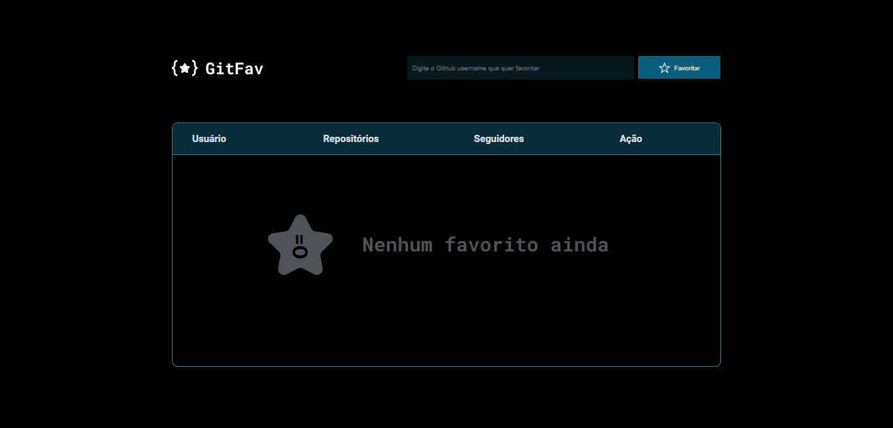
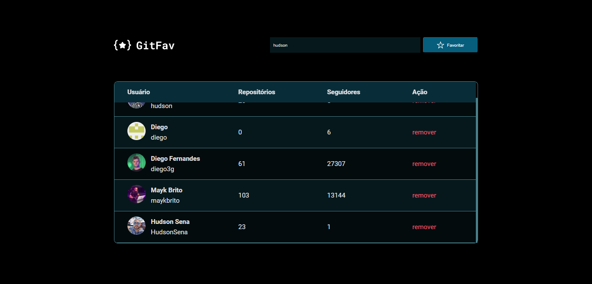

# "Github Favorites"

 

Project building from "Rocktseat" classes.

[Click here to access project](https://hudsonsena.github.io/DesafioProjeto12/)

# Technologies

- HTML
- CSS
- JavaScript
- Git e GitHub

# Learning

- scripts(functions, events, constant, variables, window, if, else)
- SPA (single page application)
- consuming API (from GIthub) 

# Contact

hudsonsena93@gmail.com